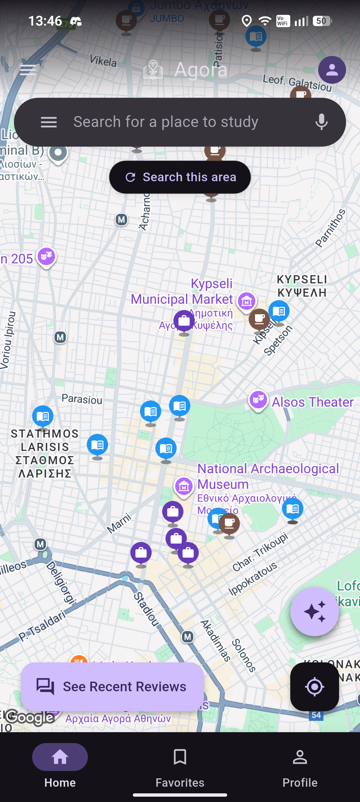
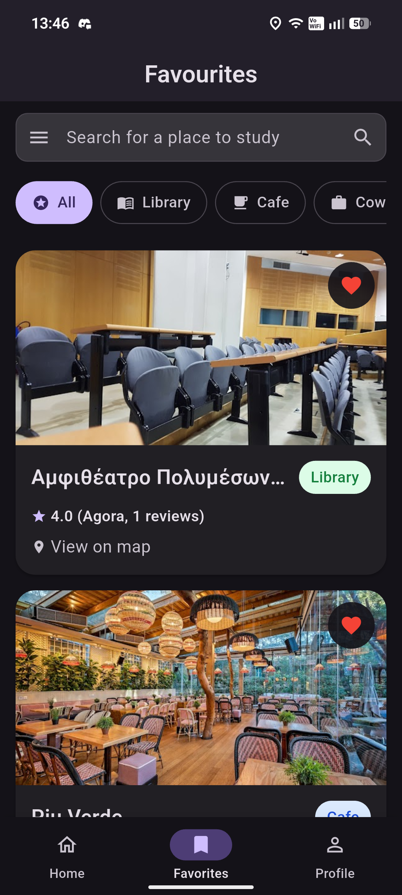
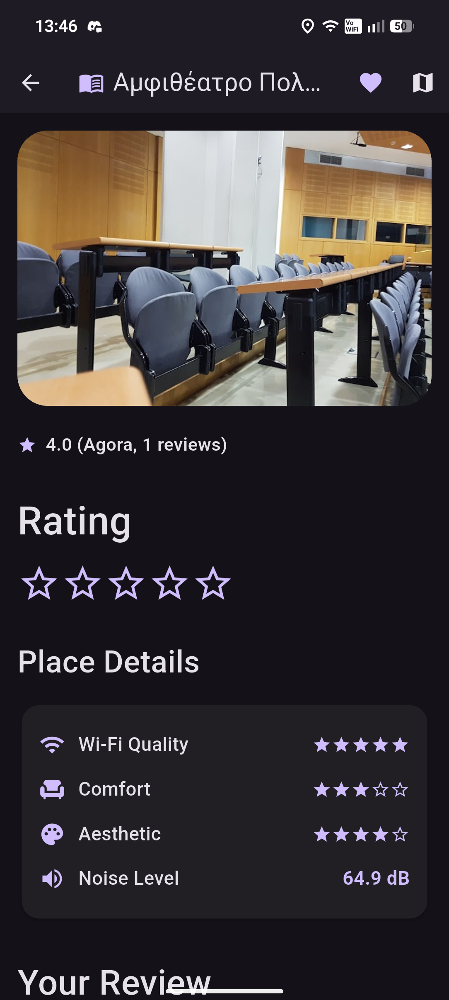
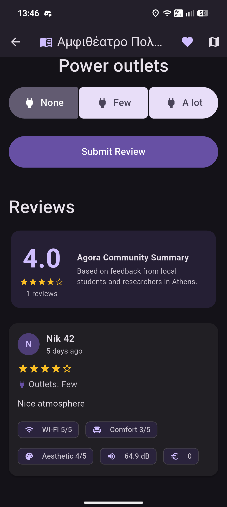
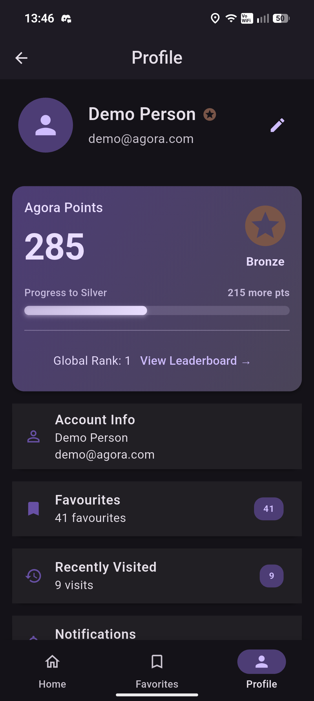
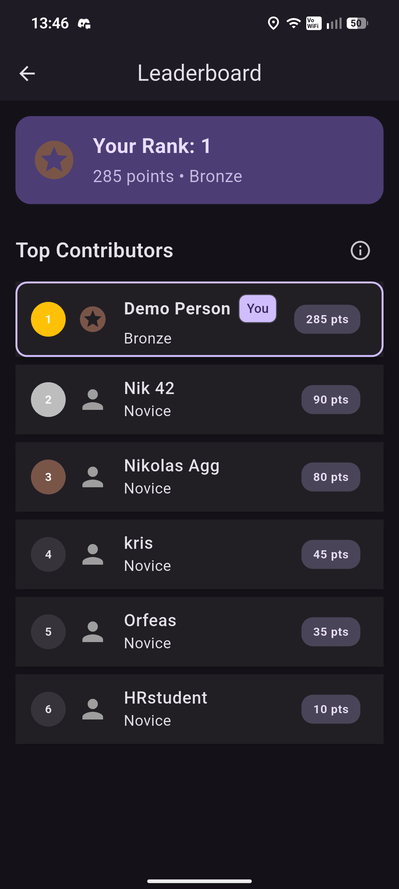
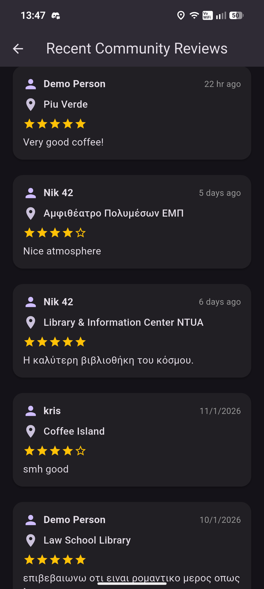

# Agora – Οδηγός Εγκατάστασης και Χρήσης

Εφαρμογή για ανεύρεση και αξιολόγηση χώρων μελέτης στην Αθήνα, με χάρτη, check-in, reviews, favorites και AI recommendation system.

## Α. Οδηγίες για εγκατάσταση σε κινητό Android

1. Το αρχείο εγκατάστασης APK βρίσκεται στο Tab Releases του GitHub.
   [Πάτα εδώ](https://github.com/nicholas-agg/Agora-HCI-2025/releases/download/v1.0.0/agora-release.apk)
   Αποθήκευσέ το πιο πρόσφατο APK στο κινητό σου.
2. Πάτα στο APK. Αν το κινητό ρωτήσει για άδεια «Εγκατάσταση από άγνωστες πηγές», επίλεξε Ενεργοποίηση/Allow.
3. Πάτα Εγκατάσταση. Μόλις ολοκληρωθεί, πάτα Άνοιγμα ή βρες το εικονίδιο «Agora» στην αρχική οθόνη.
4. Άνοιξε την εφαρμογή:
   - Συνδέσου με email/κωδικό ή δημιούργησε νέο λογαριασμό (θα σου ζητήσει επιβεβαίωση email).
   - Δώσε άδεια τοποθεσίας για να βλέπεις κοντινούς χώρους και να κάνεις check-in.
   - Στον χάρτη βρίσκεις χώρους μελέτης, μπορείς να κάνεις check-in, να τους αποθηκεύεις στα αγαπημένα και να γράφεις/διαβάζεις αξιολογήσεις.
5. Αν θες απλώς να δοκιμάσεις την εφαρμογή, χρησιμοποίησε τους demo κωδικούς (email: demo / password: agorademo).

## Β. Πληροφορίες συμβατότητας / APK

- Το Android SDK που χρησιμοποιήθηκε για την ανάπτυξη της εφαρμογής είναι Android SDK version 35.0.1.
- Το παρεχόμενο APK λειτουργεί σε συσκευές με Google Play (Google APIs). Αν θέλεις να το κάνεις build from source, μπορείς με `flutter build apk`.

## Γ. Περιγραφή Εφαρμογής

Η Agora είναι η πρώτη εφαρμογή που κάνει πραγματικά εύκολη και αποτελεσματική
την εύρεση σημείων μελέτης και επαγγελματικής συνεργασίας στην Αθήνα. Η νέα αυτή
πλατφόρμα έχει σχεδιαστεί για να καλύπτει τις ανάγκες μαθητών, φοιτητών και
επαγγελματιών που αναζητούν έναν χώρο όπου μπορούν να συγκεντρωθούν, να
(συν)εργαστούν και να αναπτυχθούν δημιουργικά, με τους δικούς τους όρους και
προτιμήσεις.

Με την Agora μπορείς:
- Να βρεις cafes, study hubs, collaboration rooms, βιβλιοθήκες κοντά σου ανά
  πάσα στιγμή, χρησιμοποιώντας εύκολη πλοήγηση σε χάρτη και φίλτρα ανάλογα
  με τον τύπο του χώρου, την τοποθεσία ή τη διαθεσιμότητα.
- Να ενημερωθείς για πρακτικές λεπτομέρειες που κάνουν τη διαφορά, όπως:
  - Υπάρχουν πρίζες και αν ναι, πόσες και πού βρίσκονται;
  - Είναι το Internet γρήγορο, σταθερό και δωρεάν ή απαιτείται πληρωμή;
  - Ποιο είναι το μέσο κόστος κατανάλωσης ή παραμονής;
  - Πόσο ήσυχο ή πολυσύχναστο είναι το περιβάλλον;
  - Πώς είναι η αισθητική και η άνεση του χώρου;
  - Τι γνώμη έχουν όσοι τον έχουν ήδη επισκεφθεί;

Η Agora βασίζεται στη δύναμη της κοινότητας των μελών της για να αντλήσει
αξιόπιστες πληροφορίες και να παρέχει μια δυναμική, ενημερωμένη εμπειρία σε όλους
τους χρήστες. Με μια απλή εγγραφή μπορείς να συμβάλεις κι εσύ, προσθέτοντας
κριτικές, φωτογραφίες ή βαθμολογίες που βοηθούν άλλους να κάνουν την ιδανική
επιλογή. Η συμμετοχή σου ανταμείβεται με trust points, οι οποίοι αντιστοιχούν σε
επίπεδα δραστηριότητας και αναγνώρισης μέσα στην κοινότητα. Όσο περισσότερο
συνεισφέρεις, τόσο αυξάνεται η επιρροή σου στις προτάσεις της εφαρμογής, αλλά και
η πρόσβασή σου σε νέα χαρακτηριστικά και ειδικές λειτουργίες πριν από όλους τους
άλλους.

Η εξατομίκευση της εμπειρίας αποτελεί τον πυρήνα της Agora. Κάθε φορά που
χρησιμοποιείς την εφαρμογή, καταγράφουμε ανώνυμα τις προτιμήσεις σου — όπως
τον τύπο χώρου, τη στάθμη θορύβου ή την τοποθεσία που προτιμάς — με απόλυτο
σεβασμό στην ιδιωτικότητά σου. Με αυτόν τον τρόπο, η Agora μαθαίνει σταδιακά τι
σου ταιριάζει και μπορεί να σου προτείνει τον ιδανικό χώρο πριν καν το ζητήσεις. Το
αποτέλεσμα είναι μια έξυπνη, προσωποποιημένη εμπειρία που εξελίσσεται μαζί σου και
κάνει την καθημερινότητά σου πιο παραγωγική και ευχάριστη.

## Δ. Λειτουργικές απαιτήσεις

- Συλλογή πληροφοριών σχετικά με τα μέρη διαβάσματος. Παραδείγματα:
  Ποιότητα Wi-Fi, μέση τιμή γευμάτων-προϊόντων, αριθμός πριζών-πρόσβαση σε
  πρίζες, δημοφιλία, αξιολογήσεις. (Άξονας 1 – Crowdsourcing)
- Λειτουργία μέτρησης και καταχώρησης επιπέδου θορύβου περιβάλλοντος
  διαβάσματος (εγγραφή ηχητικού αποσπάσματος -> χρήση AI για εξαγωγή
  επιπέδου θορύβου). (Άξονας 2 – AI, Άξονας 2 – Audio [Microphone])
- Απόδοση πόντων στους χρήστες. Κάθε καταχώρηση πληροφορίας για μέρη
  μελέτης αποδίδει πόντους στους χρήστες. Οι χρήστες με περισσότερους
  πόντους έχουν μεγαλύτερη βαρύτητα. (Άξονας 1 – Gamification)
- Επισύναψη φωτογραφιών σε χώρους μελέτης. (Άξονας 2 – Camera)
- Χρήση τοποθεσίας για την ανίχνευση κοντινών χώρων μελέτης. (Άξονας 3 – GPS)
- Εξατομίκευση εύρεσης χώρων μελέτης ανάλογα με τον χρήστη. Συλλέγονται
  ανώνυμες πληροφορίες για τον χρήστη και με τη χρήση τους προτείνονται χώροι
  μελέτης με τα χαρακτηριστικά που προτιμά (π.χ. γρήγορη πρόσβαση Internet,
  ησυχία κτλ.). (Άξονας 1 – Μοντελοποίηση χρήστη και προσαρμογή)

## Ε. Διαφορές Εφαρμογής σε Σχέση με το Πρωτότυπο

- Αισθητικές αλλαγές σε ορισμένα στοιχεία (Profile page, Settings, Review page)
- Προσθήκη Dark Mode
- Προσθήκη συστήματος επιβράβευσης χρήστη με πόντους (Κάθε κριτική κερδίζει ορισμένους πόντους, με τους οποίους ο χρήστης ανεβαίνει στις κατατάξεις)
- Δυνατότητα προβολής πρόσφατων κριτικών
- Λειτουργία Check-In στον χώρο (Χρήση της τοποθεσίας του χρήστη για να επιβεβαιώσουμε την παρουσία του στον χώρο)

## ΣΤ. Στιγμιότυπα Εφαρμογής

Παρακάτω μπορείτε να δείτε στιγμιότυπα από την εφαρμογή Agora:

  
  
  
  
  
  
  

## Ζ. Βίντεο Παρουσίασης Εφαρμογής

Δείτε το βίντεο παρουσίασης της εφαρμογής Agora στον παρακάτω σύνδεσμο:

[Παρακολούθηση Βίντεο](https://ntuagr-my.sharepoint.com/:v:/g/personal/el21815_ntua_gr/IQAekN6Qk_rnSbS31g60_AOYAaJuVCkxt4MJZdrCYKHqFbM?e=HBd8sL)
